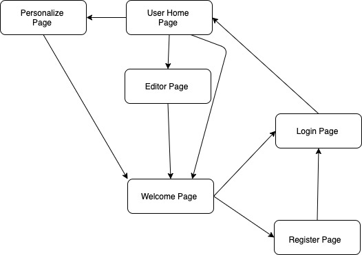

# Journal *365*
### Spring 2022 CSCI-UA 0467

---

## Overview

### A web application for writing diaries

Functionality
- User register & login
  - authentication & password hashing
- After login, one can
	- see one's own journals
	- create new journals, including text & uploading files/images
    - edit one's own journals
	- delete one's own journals
	- set/change background for one's homepage (this changes the background for all pages after login, e.g., viewJournal, editJournal, etc.)
	- set/change one's profile image
---

## Data Model

The application will store Users and Journals

* users can have multiple journals (by embedding), but only one background image and profile image
* each journal will have text, attached_files, and date_created

An Example User:

```javascript
{
  username: "Nigel",
  pwd: // a password hash,
  journals: // an array of embedded Journal Schemas,
  background: // uploaded background image, retrieved via API,
  profileImg: // self-defined profile image, retrieved via API,
}
```

An Example of embedded Journal:

```javascript
{
  title: // journal title,
  content: // journal content,
  files: // uploaded related files, retrieved via API,
  dateCreated: // timestamp
}
```


## [Link to Commented First Draft Schema](db.js) 

## Wireframes

Pages included in the PDF
- Welcome Page
- Register Page
- Login Page
- User Home Page
- Editor Page (a.k.a, createJournal/editJournal page)
- Personalize Page (a.k.a, addBackground page)

[wireframes pdf link](documentation/wireframes.pdf)

## Site map


## User Stories or Use Cases

1. as non-registered user, I can visit the home page/register as a new user to this site.
2. as a user, I can log in to the site
3. as a user, I can create a new journal (title, content, and files)
4. as a user, I can view all of the journals I created in the past
5. as a user, I can edit the journals I created in the past
6. as a user, I can delete any journal I created
7. as a user, I can personalize my background image, which would be synced across all pages after login (i.e., excludes welcome, login, and register pages)
8. as a user, I can personalize my profile image, which would be synced across all pages after login (i.e., excludes welcome, login, and register pages)

## Research Topics
### 15 points total

* (3 points) Add Unit Tests
    * I'm going to be using Jest & Supertest (a library based on Superagent) to do unit tests for both React frontend and Express backend
    * Here is my [Express Backend Tests](/backend/__test__)
        * Screenshot for Express Backend Tests 
    * Here is my [React Frontend Tests](/src/__test__). 
        * **Note** that this is only the link to test file that tests the app as a whole. Individual component tests can be found in */src/components/\[component_name\]/\_\_test\_\_*
        * Screenshot for React Frontend Tests 
* (2 points) Perform client side form validation using a JavaScript library
    * I will be using a 3rd-party JavaScript library named *validator* for doing form validation before submitting it to the server
    * Here is the [FormValidator](/src/FormValidator.js) I implemented
    * Here is a [showcase](/src/components/addJournal/addJournal.component.js#L15-L38) of client-side validation I implemented (**NOTE** Multiple validations are implemented in the project, and this is one of them mentioned for showcasing)
    * reference: @[mikeries](https://github.com/mikeries/react-validation-tutorial)
* (5 points) React JS
    * I will be using React JS as my front-end library. 
    * As this is a library that takes much effort to master, I will assign to this 5 points
    * Here is the [Link](/src/components) to all the React components I implemented
* (2 points) Bootstrap CSS Framework
    * I will be consistently using Bootstrap as my CSS library throughout the site
* (1 points) File Upload with Multer
    * I will be using third-party package named *Multer* for managing file uploads
    * Here is the [Server Setup](/backend/routes/index.js#L10-L20)
    * Here are two examples of components that allow file upload with *Multer*
        * [addJournal](/src/components/addJournal/addJournal.component.js#L87-L112)
        * [addBackground](/src/components/addBackground/addBackground.component.js#L79-L104)
* (2 points) Axios HTTP Client
    * I will be using Axios for making HTTP requests
    * As this adds some work for hard coding form headers and figuring out miscellaneous HTTP request details, I will assing 2 points (unlike using HTML form, which just needs to set attributes like actoin, method, etc.)
* (0 point) Miscellaneous 
    * I will be using Dotenv to manage all my environment variables for project-wide usage

15 points total out of 8 required points 


## [Link to Initial Main Project File](/backend/app.js) 

## Annotations / References Used

1. [MERN Full Stack Tutorial](https://www.youtube.com/watch?v=ktjafK4SgWM)
2. [React JS Documentation](https://reactjs.org/docs/getting-started.html)
3. [Passport Documentation](https://www.passportjs.org/docs/)
4. [Form Validator Boilertemplate](https://github.com/mikeries/react-validation-tutorial)
5. [Supertest Library](https://www.npmjs.com/package/supertest)
